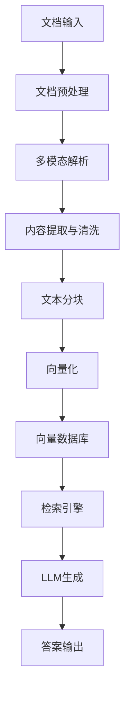

# RAG系统落地方案

## 项目概述

本项目旨在为20GB左右的混合文档资源库构建一个完整的RAG（Retrieval-Augmented Generation）系统，涵盖PDF、DOCX、图片、表格、PPT等多种文档类型的智能检索与问答系统。

## 1. 系统架构设计

### 1.1 整体架构



### 1.2 核心组件

#### 1.2.1 文档处理层
- **文档接收模块**: 支持批量上传、增量更新
- **格式识别模块**: 自动识别文档类型
- **预处理模块**: 文档标准化、格式转换

#### 1.2.2 内容解析层
- **文本解析器**: PDF、DOCX文本提取
- **图像解析器**: OCR、图像理解
- **表格解析器**: 结构化数据提取
- **PPT解析器**: 幻灯片内容解析

#### 1.2.3 数据管理层
- **清洗模块**: 去重、去噪、格式标准化
- **分块策略**: 智能文档分块
- **元数据管理**: 文档来源、版本、标签

#### 1.2.4 向量存储层
- **向量化引擎**: 多模态嵌入模型
- **向量数据库**: 高效相似性检索
- **索引策略**: 混合索引方案

## 2. 多模态文档处理方案

### 2.1 文档类型处理策略

#### 2.1.1 PDF文档
- **技术选择**: PyPDF2, pdfplumber, unstructured
- **处理流程**:
  - 文本提取
  - 表格识别与提取
  - 图像检测与分离
  - 页面结构分析

#### 2.1.2 DOCX文档
- **技术选择**: python-docx, unstructured
- **处理流程**:
  - 段落提取
  - 表格解析
  - 图片提取
  - 样式信息保留

#### 2.1.3 图像文档
- **技术选择**: OCR (PaddleOCR/Tesseract), 视觉模型
- **处理流程**:
  - 文字识别
  - 布局分析
  - 图像描述生成
  - 关键信息提取

#### 2.1.4 表格数据
- **技术选择**: camelot, tabula, pandas
- **处理流程**:
  - 表格结构识别
  - 数据提取与清洗
  - 关系映射
  - 语义理解

#### 2.1.5 PPT文档
- **技术选择**: python-pptx, unstructured
- **处理流程**:
  - 幻灯片文本提取
  - 图表解析
  - 页面结构分析
  - 演示逻辑理解

### 2.2 统一数据模型

```python
class DocumentChunk:
    def __init__(self):
        self.id: str          # 唯一标识
        self.content: str     # 文本内容
        self.metadata: dict   # 元数据
        self.embedding: list  # 向量表示
        self.source_type: str # 文档类型
        self.chunk_type: str  # 内容类型
```

## 3. 向量存储与检索策略

### 3.1 向量化方案

#### 3.1.1 文本嵌入模型
- **主模型**: sentence-transformers (多语言支持)
- **备选模型**: OpenAI Embedding, 本地部署模型
- **模型选择标准**:
  - 支持中文优化
  - 向量维度: 768-1536
  - 检索效果 vs 计算成本平衡

#### 3.1.2 多模态嵌入
- **图像嵌入**: CLIP, ViT
- **表格嵌入**: TableBERT
- **统一向量空间**: 跨模态对齐

### 3.2 向量数据库选型

#### 3.2.1 选项对比
| 数据库 | 优势 | 劣势 | 适用场景 |
|--------|------|------|----------|
| Chroma | 轻量级、易部署 | 规模限制 | 小到中型数据 |
| Pinecone | 云服务、高性能 | 成本较高 | 生产环境 |
| Qdrant | 开源、高性能 | 运维复杂 | 大规模数据 |
| Milvus | 开源、功能全 | 资源消耗大 | 企业级应用 |

#### 3.2.2 推荐方案
- **初期**: Chroma (快速原型验证)
- **生产**: Qdrant (平衡性能与成本)
- **扩展**: Milvus (大规模部署)

### 3.3 检索策略

#### 3.3.1 混合检索
- **向量检索**: 语义相似性
- **关键词检索**: BM25算法
- **重排序**: 交叉编码器优化

#### 3.3.2 检索优化
- **分块策略**: 固定大小 + 语义边界
- **重叠策略**: 滑动窗口保证上下文
- **过滤策略**: 元数据过滤、时间过滤

## 4. 系统技术栈

### 4.1 后端技术栈

#### 4.1.1 核心框架
- **Python 3.9+**: 主要开发语言
- **FastAPI**: API服务框架
- **Celery**: 异步任务队列
- **Redis**: 缓存与消息队列

#### 4.1.2 文档处理
- **unstructured**: 统一文档解析
- **langchain**: RAG框架
- **pymupdf**: PDF处理
- **python-docx**: DOCX处理
- **Pillow**: 图像处理

#### 4.1.3 机器学习
- **sentence-transformers**: 文本嵌入
- **transformers**: 预训练模型
- **torch**: 深度学习框架
- **scikit-learn**: 传统机器学习

### 4.2 前端技术栈

#### 4.2.1 界面框架
- **React**: 前端框架
- **TypeScript**: 类型安全
- **Ant Design**: UI组件库
- **Markdown**: 结果展示

#### 4.2.2 可视化
- **ECharts**: 图表展示
- **D3.js**: 自定义可视化
- **React Flow**: 流程图展示

### 4.3 基础设施

#### 4.3.1 数据存储
- **PostgreSQL**: 关系型数据
- **Redis**: 缓存数据库
- **MinIO**: 对象存储
- **Elasticsearch**: 全文检索

#### 4.3.2 部署运维
- **Docker**: 容器化部署
- **Kubernetes**: 容器编排
- **Nginx**: 反向代理
- **Prometheus**: 监控告警

## 5. 实施计划

### 5.1 第一阶段：原型验证 (2-3周)
- [ ] 搭建基础开发环境
- [ ] 实现核心文档解析功能
- [ ] 集成基础向量数据库
- [ ] 构建简单检索接口

### 5.2 第二阶段：功能完善 (3-4周)
- [ ] 优化多模态文档处理
- [ ] 实现高级检索策略
- [ ] 开发用户界面
- [ ] 性能优化与测试

### 5.3 第三阶段：生产部署 (2-3周)
- [ ] 系统集成测试
- [ ] 性能压力测试
- [ ] 部署上线
- [ ] 监控与运维配置

## 6. 预期效果与评估指标

### 6.1 性能指标
- **检索准确率**: >85%
- **响应时间**: <2秒
- **并发处理**: 支持100+用户
- **数据规模**: 支持50GB+文档

### 6.2 功能指标
- **文档类型支持**: 5种以上
- **多语言支持**: 中英文
- **实时更新**: 支持增量索引
- **权限管理**: 多级权限控制

## 7. 风险评估与应对

### 7.1 技术风险
- **模型性能**: 准备备选模型方案
- **数据质量**: 建立数据清洗流程
- **系统稳定性**: 完善监控与容错机制

### 7.2 业务风险
- **需求变更**: 采用敏捷开发方法
- **时间延期**: 合理安排缓冲时间
- **资源不足**: 分阶段实施策略

## 8. 总结

本RAG方案采用模块化设计，支持多种文档类型的智能处理，通过向量化技术实现高效检索，为大容量文档库提供智能问答能力。方案兼顾技术可行性与业务需求，为后续扩展预留充分空间。