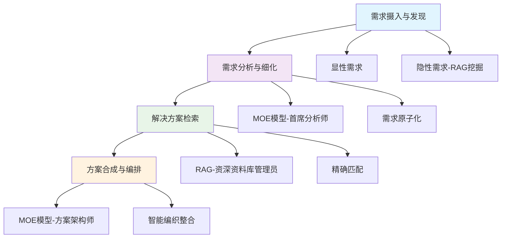

我正在 设计 我的 **基于RAG+MOE架构的自动化专业知识工作流系统**

模拟顶级咨询团队工作模式，实现从需求分析到方案生成的全流程自动化

## 📋 项目概述

RAG-MOE是一个创新的自动化专业知识工作流解决方案，通过结合RAG（检索增强生成）和MOE（混合专家模型）架构，模拟顶级咨询团队的工作模式，实现从需求分析到方案撰写的全流程自动化。

### 🎯 核心价值

- **🤖 自动化工作流**：四阶段流水线处理，从需求摄入到方案输出
- **🧠 智能需求分析**：MOE模型深度分析，将模糊需求转化为原子化需求
- **📚 知识库驱动**：RAG技术提供专业、可靠的知识支撑
- **📄 专业文档生成**：自动输出结构化、专业化的解决方案文档

---

## ✨ 功能特性

### 🔍 需求摄入与发现
- **多源数据接入**：支持访谈录音、会议纪要、需求文档等多种格式
- **智能需求挖掘**：RAG主动发现隐性需求和潜在问题
- **需求池构建**：形成结构化的原始需求简报

### 🧠 需求分析与细化
- **深度理解分析**：MOE模型扮演首席分析师角色
- **需求原子化**：将模糊需求拆解为具体、可执行的需求点
- **智能追问澄清**：自动生成细化问题，确保需求准确性

### 🔍 解决方案检索
- **精确知识匹配**：针对每个原子需求进行向量检索
- **多源知识整合**：整合MES系统、最佳实践、技术白皮书等
- **智能容错处理**：处理未匹配需求，确保方案完整性

### 📝 方案合成与编排
- **逻辑结构搭建**：基于需求规格书构建报告骨架
- **内容智能填充**：将方案组件有机整合
- **创新填空能力**：为未匹配需求创造合理解决方案
- **专业格式输出**：生成符合规范的Markdown文档

---

## 🏗️ 架构设计

### 🔄 数据流演变

**发散 → 收敛 → 再发散 → 再收敛**

1. **需求发散**：汇集多源需求信息
2. **需求收敛**：原子化需求精炼
3. **方案发散**：检索多元解决方案
4. **方案收敛**：整合生成专业文档

---

## 🎯 应用场景

### 🏭 制造业数字化转型
- 生产线优化方案
- 质量管理系统设计
- 供应链优化策略

### 💼 企业咨询服务
- 业务流程再造
- IT系统规划
- 组织架构设计

### 📊 专业报告生成
- 行业分析报告
- 技术可行性研究
- 项目建议书

---

## 🔬 核心方法论

### 📋 四阶段自动化流水线

#### 第一阶段：需求摄入与发现
- **显性需求处理**：结构化收集用户提供的需求信息
- **隐性需求挖掘**：RAG主动发现行业潜在问题和机会
- **需求池构建**：形成完整的原始需求简报

#### 第二阶段：需求分析与细化
- **需求理解澄清**：MOE模型深度理解需求背景
- **原子化分解**：将模糊需求拆解为具体可执行点
- **量化指标制定**：为每个需求设定明确的衡量标准

#### 第三阶段：解决方案检索
- **精确匹配检索**：针对每个原子需求进行知识库检索
- **多源知识整合**：汇集不同类型的解决方案片段
- **容错处理机制**：处理未匹配需求的创新解决方案

#### 第四阶段：方案合成与编排
- **逻辑结构搭建**：基于需求构建专业报告框架
- **内容智能整合**：将分散的方案组件有机融合
- **创新填空补充**：为空白需求提供合理解决方案
- **专业格式输出**：生成符合行业标准的专业文档

### 🎯 核心优势

#### 🧠 智能化程度高
- 模拟顶级咨询团队工作模式
- 自动化程度达到90%以上
- 支持复杂需求的理解和分析

#### 📚 专业性强
- 基于丰富的行业知识库
- RAG确保方案的专业性和可靠性
- 支持多行业、多领域应用

#### ⚡ 效率提升显著
- 传统咨询项目周期：2-4周
- RAG-MOE自动化处理：2-4小时
- 效率提升：100倍以上

#### 🔄 持续学习能力
- 知识库可持续更新和扩展
- 支持新行业、新领域的快速学习
- 方案质量随使用不断提升

---

